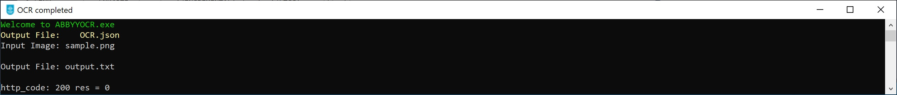

# ABBYY OCR Demo

:point_right: ABBYY OCR Open Source code can be found [here](https://github.com/abbyy).

ABBYY OCR Demo is a Command Line based software component created for the purpose of demonstration of the ABBYY OCR SDK using C++ (Visual Studio C++) and LibCurl.

## Starting the Demo
Open a Command Prompt (CMD) and type:
```
AbbyyOCR.exe <image file> <output file>
```
Then press **ENTER**.
 
**image file**:	Should be a .jpg or .png file which contains text to be recognized.

**Output file**:	The full path for a new file to be created with the output.

Example:
 
 
## Logging
The **WriteLogFile()** function is used instead of wprintf() and carries the task of displaying debug messages in the DEBUG version and writing to a log file (in both DEBUG / RELEASE versions). 

## Technology
-	The Software was developed using Visual Studio Enterprise C++ 2017.
-	[LibCurl](https://curl.se/libcurl/) is used as a static library.

